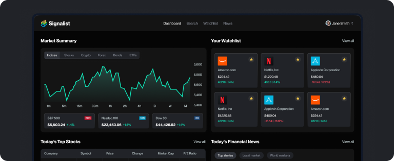

# Signalist

Signalist is a comprehensive stock market dashboard and watchlist management application. It provides real-time market data, technical analysis tools, and personalized stock tracking to help investors make informed decisions.



## Features

- **Interactive Dashboard**: Real-time market overview, heatmaps, and top stories using TradingView widgets.
- **Stock Search & Details**: Detailed information for thousands of stocks, including candle charts, technical analysis, company profiles, and financial data.
- **Personalized Watchlist**: Add stocks to your watchlist and track their performance.
- **AI-Powered Insights**: Automated stock analysis and prompts powered by Gemini AI.
- **Authentication**: Secure sign-in and sign-up with personalized investment goals and risk tolerance settings.
- **Background Jobs**: Scheduled tasks and automation handled by Inngest.
- **Email Notifications**: Integrated email system using Nodemailer for alerts and communication.

## Tech Stack

- **Framework**: [Next.js 15](https://nextjs.org/) (App Router)
- **Language**: [TypeScript](https://www.typescriptlang.org/)
- **Database**: [MongoDB](https://www.mongodb.com/) with [Mongoose](https://mongoosejs.com/)
- **Authentication**: [better-auth](https://www.better-auth.com/)
- **Styling**: [Tailwind CSS](https://tailwindcss.com/)
- **UI Components**: [Radix UI](https://www.radix-ui.com/), [Lucide React](https://lucide.dev/), [Sonner](https://sonner.emilkowal.ski/)
- **Background Jobs**: [Inngest](https://www.inngest.com/)
- **External APIs**: [Finnhub Stock API](https://finnhub.io/), [Gemini AI API](https://ai.google.dev/), [TradingView Widgets](https://www.tradingview.com/widget/)
- **Email**: [Nodemailer](https://nodemailer.com/)

## Project Structure

```text
signalist/
├── app/                # Next.js App Router (pages and API routes)
├── components/         # Reusable UI components
├── database/           # MongoDB models and connection logic
├── hooks/              # Custom React hooks
├── lib/                # Shared utilities, actions, and configurations
├── middleware/         # Next.js middleware
├── public/             # Static assets (images, icons)
├── types/              # TypeScript type definitions
└── ...configs          # ESLint, Tailwind, TypeScript, etc.
```

## Getting Started

### Prerequisites

- Node.js 20+ and npm
- MongoDB instance (local or Atlas)
- [Finnhub API Key](https://finnhub.io/)
- [Gemini API Key](https://ai.google.dev/)
- [Inngest Cloud](https://www.inngest.com/) (for background jobs)

### Installation

1. Clone the repository:
   ```bash
   git clone https://github.com/your-username/signalist.git
   cd signalist
   ```

2. Install dependencies:
   ```bash
   npm install
   ```

3. Set up environment variables:
   Create a `.env` file in the root directory and add the following:
   ```env
   # Database
   MONGODB_URI=your_mongodb_uri

   # Auth
   BETTER_AUTH_SECRET=your_better_auth_secret
   BETTER_AUTH_URL=http://localhost:3000

   # External APIs
   FINNHUB_API_KEY=your_finnhub_api_key
   NEXT_PUBLIC_FINNHUB_API_KEY=your_finnhub_api_key
   GEMINI_API_KEY=your_gemini_api_key

   # Email
   NODEMAILER_EMAIL=your_email@example.com
   NODEMAILER_PASSWORD=your_email_password

   # TODO: Add any other required environment variables
   ```

### Running the Application

Run the development server:

```bash
npm run dev
```

Open [http://localhost:3000](http://localhost:3000) with your browser to see the result.

## Available Scripts

- `npm run dev`: Starts the development server with Turbopack.
- `npm run build`: Builds the application for production.
- `npm run start`: Starts the production server.
- `npm run lint`: Runs ESLint for code quality checks.
- `npm run test:db`: Tests the MongoDB connection.

## Testing

Current testing is focused on database connectivity:
```bash
npm run test:db
```
*Note: Full suite of unit/integration tests is TODO.*